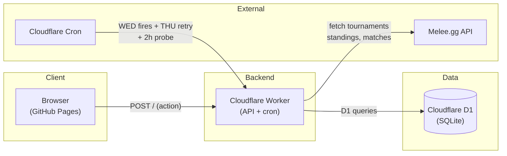
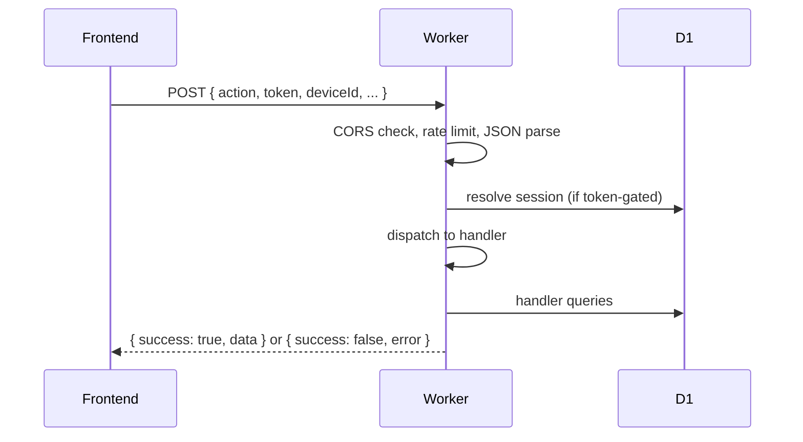
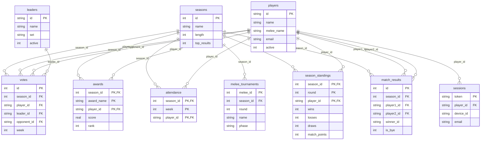
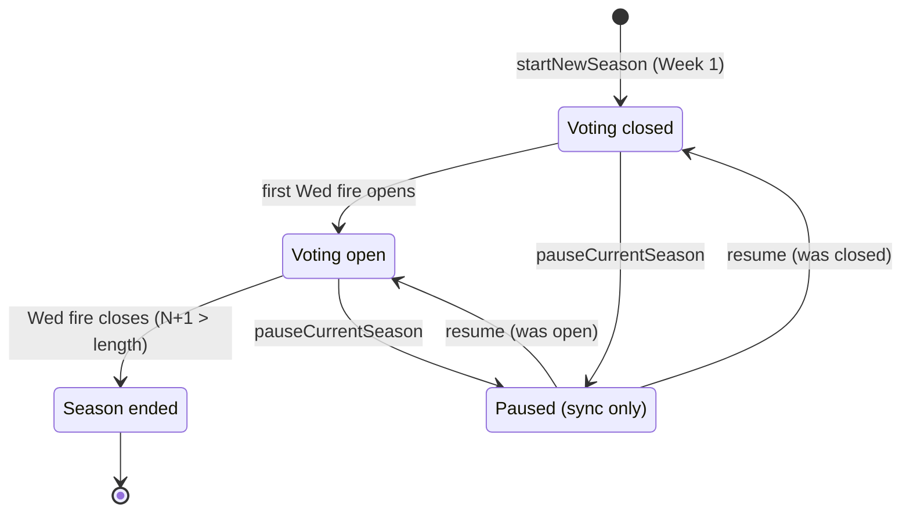

# Architecture

System overview, data relationships, and the sync lifecycle. For domain definitions,
see [`CONTEXT.md`](../CONTEXT.md). For the D1 schema reference, see
[`DATABASE.md`](DATABASE.md).

## System components

- **Frontend** (`docs/app/`) — static HTML/JS on GitHub Pages. No build step. Calls the
  Worker directly with `fetch`.
- **Worker** (`backend/src/`) — single entry point. Routes POST requests to 20 action
  handlers. Runs the sync lifecycle on cron fires.
- **D1** — 11 tables, 9 indexes. Schema in `backend/schema.sql`.
- **Melee.gg** — external source of truth for tournament results. See
  [`MELEE.md`](MELEE.md) for API notes.

## Request flow

## ER diagram

**Notes:**
- `melee_tournaments` links to `season_standings` and `match_results` logically via
  `(season_id, round)` — enforced by `UNIQUE(season_id, round)`, not a declared FK.
- `votes.opponent_id` points to another player (the favorite opponent).
- `awards.rank` (Galactic Ruler 1/2/3) was migrated out-of-band (M4) and is now
  also declared in `schema.sql` — the two match.

## Season lifecycle state machine

**Advance (not a separate state):** while voting is open, each eligible Wed fire sets
`CURRENT_WEEK` to `Week N+1` and records `LAST_ADVANCED`. `VOTING_OPEN` stays true —
votes simply refer to the new week.

**Advance gate:** week-advance and voting-open happen only when Stockholm local day is
Wednesday AND local time ≥ 22:10 AND `LAST_ADVANCED` ≠ today. Thursday fire retries
without the time gate.

**Two-try open:** the primary Wednesday fire defers if the night has no attendance data;
the retry fire always acts. This ensures voting opens every league night ~1h later at
worst.

## Sync lifecycle

Runs on every cron fire. Idempotent — catches late-published Melee results.

1. **Gate:** skip if no active season
2. **Fetch:** tournaments from Melee.gg; insert new ones
3. **Sync records:** standings + matches for unsynced rounds — delegated to the
   shared data engine `lib/leagueSync.js` (`syncSeasonData`), which the cron sync
   and the admin backfill both call. The engine writes only players /
   melee_tournaments / season_standings / match_results / attendance (never
   `settings`/`awards`); lifecycle logic stays in this trigger.
4. **Attendance:** rebuilt from regular standings (engine, per round)
5. **Awards refresh:** recompute live podiums (Schemer, Ambassador, Ruler, etc.)
6. **Pause gate:** if paused → return (data synced, no lifecycle writes)
7. **Advance gate:** Wednesday + ≥ 22:10 + marker ≠ today
8. **State machine:** open → advance → close (see diagram above)

Statuses: `skipped` / `fetch-failed` / `paused` / `post-close-sync` /
`synced-no-advance` / `synced-deferred` / `voting-opened` / `season-ended` / `advanced`.
